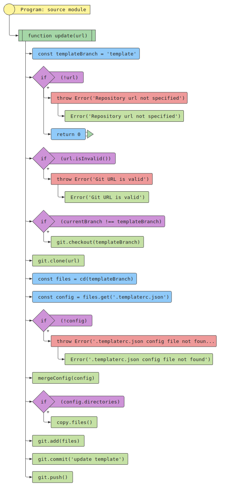
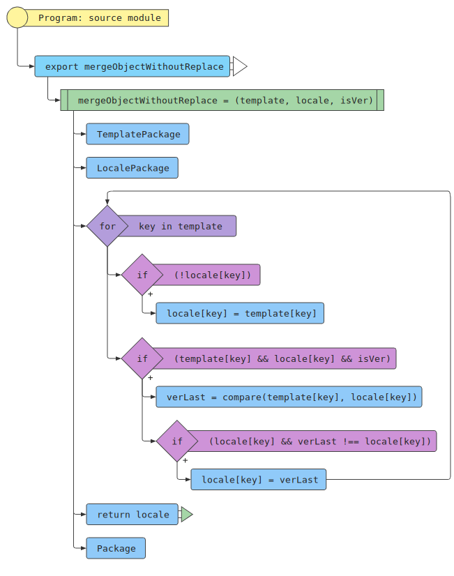
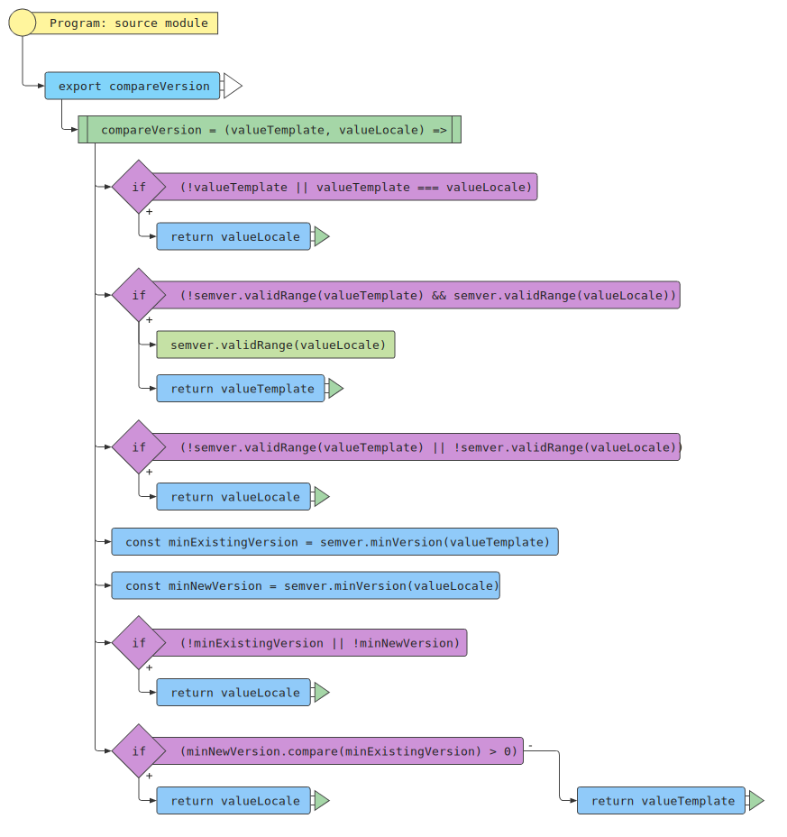

# npx-update-template
[](https://npmjs.org/package/@smartworld.team/npx-update-template)
[](https://npmjs.org/package/@smartworld.team/npx-update-template)

When creating a repository template, there is a problem with updating a child repository, this package will help you make updates almost painlessly.
At the moment, automation is that this package will reduce the update to actions that cannot be done without a person. The repository will be updated and uploaded to a specific branch named: template. After all the updates - you just have to merge the two branches and test.
## Get started
### How to use

### Install npm package in you template repo:

```
npm i @smartworld.team/npx-update-template
```

### Create a file at the root template repo:

```
touch .templaterc.json
```

### The file must consist of an object:

```
{
  directories?: Array<string>;
  templateDir?: string;
  npmDependencies?: boolean;
  npmScripts?: boolean;
  packageFile?: string;
}
```

### Example .templaterc.json 

```json
{
  "directories": ["template/src/**/*.ts", "template/core/**/*.*"],
  "templateDir": "template",
  "packageFile": "template",
  "npmDependencies": true,
  "npmScripts": true
}
```

```
directories     - An array containing the full path to the folder with masks
templateDir     - If you have a separate folder responsible for the content of the template, you need to specify where exactly the files are located
packageFile     - You can specify which dependencies to update
npmDependencies - There is a version check logic, if the template has an older version, then the version of the child repository will not be replaced. If the template is updated and has a more current version - the dependency will be replaced with the version from the template
npmScripts      - Whether scripts need to be updated. If the script already exists, the replacement will not be performed, this flag will add only non-existing scripts
```

### Script For update:
To update, create a command inside your template
```json
{
  "scripts": {
    "update": "npx-update-template git@github.com:SmartWorld-LLC/npx-update-template.git"
  }
}
```

<details>
  <summary>Charts</summary>

<details>
  <summary>Sketchy Update</summary>
  
</details>

<details>
  <summary>Merge Object</summary>
  
</details>

<details>
  <summary>Compare Version</summary>
  
</details>

</details>


## 📄 License

[MIT](./LICENSE) © [SmartWorld](https://smartworld.team)


<p align="center">
  <sub>An open source project by <a href="https://smartworld.team">SmartWorld</a> </sub>
</p>
